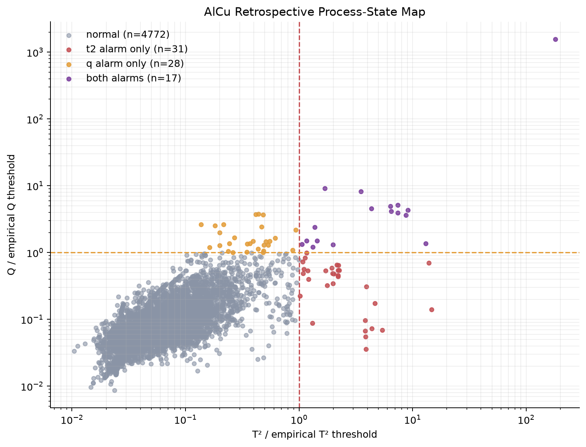
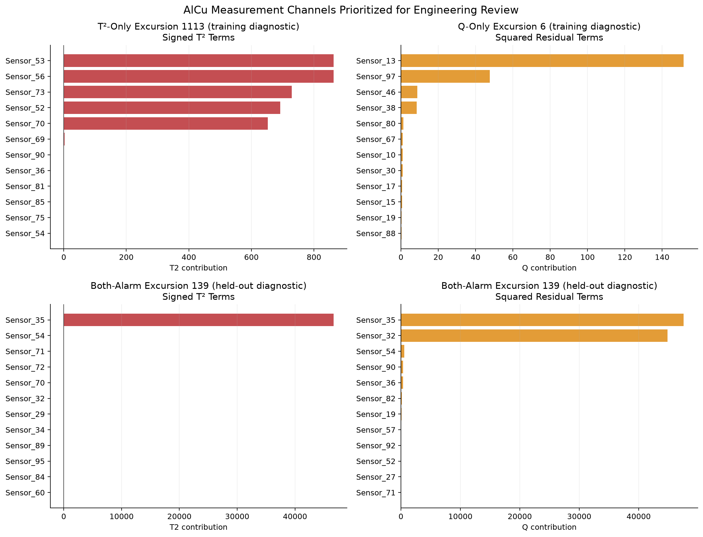
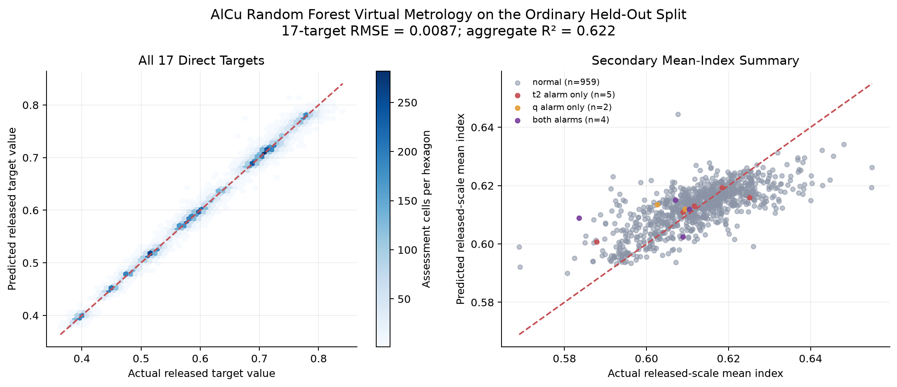

# Multivariate PVD Process Monitoring and Virtual Metrology

**Release:** v1.0

This project uses anonymized physical vapor deposition (PVD) process data to
build a retrospective multivariate process-state monitoring and virtual
metrology workflow. AlCu is the primary analysis, while WTi is a separately
fitted replication of the same workflow.

The analysis reduces correlated process inputs to a smaller monitoring view,
ranks anonymous channels for excursion review, and predicts all 17 released
target measurements directly.

## Data

The data come from Infineon's public
[Advanced Process Control and Statistical Process Control Data for Thickness Prediction of AlCu and WTi Metal Layer in Semiconductor Manufacturing](https://doi.org/10.5281/zenodo.16881338).

| Process | Input columns | Released targets | Rows |
|---|---:|---:|---:|
| AlCu | 97 | 17 | 4,848 |
| WTi | 108 | 17 | 1,740 |

The four local CSV files are unchanged copies of the release and match its MD5
checksums. They are ignored by Git. The dataset is licensed under
[CC BY 4.0](https://creativecommons.org/licenses/by/4.0/) and was published by
Amina Mević, Andreas Laber, and Senka Krivić. Download instructions and
checksums are in [`data/raw/README.md`](data/raw/README.md).

The release does not include physical units, inverse scaling, timestamps,
equipment identifiers, measurement-point coordinates, specifications, or fault
labels. All reported quantities remain on the released scale. The derived mean
index and reference-profile deviation are engineering summaries, not physical
thickness or physical uniformity.

## Method

- Audit file identity, shapes, missing values, duplicates, and X/Y row counts.
- Use a fixed 80/20 split for primary validation, then repeat validation with
  exactly equal target profiles kept together. Equal profiles are not assumed
  to be duplicate wafers.
- Keep all-zero target records in process-state monitoring, exclude them from
  primary Y-based modeling, and run with/without sensitivity checks. Their
  meaning is unknown.
- Fit standardization and PCA on training data only. Retain the fewest
  components that explain at least 90% of variance, then calculate Hotelling T²
  and Q/SPE with training-set 99th-percentile empirical alert thresholds.
- Predict the 17 targets with multi-output Linear Regression and Ridge. A fixed
  Random Forest is included because it passes a predeclared, training-only
  improvement gate. Each validation split has its own gate; only the primary
  AlCu gate transfers the model configuration to WTi.

## Results

| Result | AlCu | WTi |
|---|---:|---:|
| PCA components retained | 34 | 35 |
| Variance retained | 90.55% | 90.16% |
| Ordinary assessment alert rate | 1.13% | 4.31% |
| Random Forest 17-target MAE | 0.00615 | 0.00519 |
| Random Forest 17-target RMSE | 0.00870 | 0.00829 |
| Random Forest aggregate R² | 0.622 | 0.604 |
| Grouped-sensitivity Random Forest RMSE | 0.00926 | 0.00767 |

For AlCu, grouping identical target profiles increased Random Forest RMSE by
6.4% and reduced aggregate R² from 0.622 to 0.543. The ordinary split is
somewhat optimistic, but the grouped result retains useful released-scale
predictive signal. WTi improved under the grouped split. Because the two
processes use different released scales, their errors are not a physical
ranking.

The AlCu alerted-versus-normal output comparisons did not establish a clear
released-output shift: both clustered 95% intervals crossed zero. Only four
assessment rows triggered both T² and Q/SPE alarms, so their larger prediction
error is descriptive rather than a production rule. Aggregate and per-target
errors are listed in the [`results/` guide](results/README.md).

## Engineering figures



T² and Q/SPE provide complementary statistical excursion views; the categories
are review priorities, not fault labels.



Contribution plots identify anonymous channels to review first. They do not
establish physical causation.



The held-out predictions cover all 17 released targets directly; the mean index
is shown only as a secondary engineering summary.

## Reproduce

Place the four downloaded CSV files in `data/raw/`, then run:

```bash
python3 -m venv .venv
source .venv/bin/activate
python -m pip install -r requirements.txt
export MPLCONFIGDIR=.matplotlib-cache
python src/01_data_audit.py
python src/02_preprocess_and_quality.py
python src/03_pca_monitoring.py
python src/04_excursion_analysis.py
python src/05_virtual_metrology.py
python src/06_wti_validation.py
```

The numbered scripts run in sequence because later stages read earlier outputs.

## Limits

- X/Y pairing is positional because the release provides no join key.
- With no chronology or known-good baseline, this is retrospective multivariate
  process-state monitoring, not formal chronological SPC.
- The thresholds are empirical alerts, not validated control limits or
  independently calibrated false-alarm limits.
- Missing specifications prevent Cp/Cpk analysis, and missing fault labels
  prevent validated fault detection.
- WTi is a second released process dataset, not an external fab qualification.

See the concise [`technical report`](report/technical_report.md) for the full
method and interpretation, or the [`results/` guide](results/README.md) for the
main tables and supporting sensitivity outputs.
