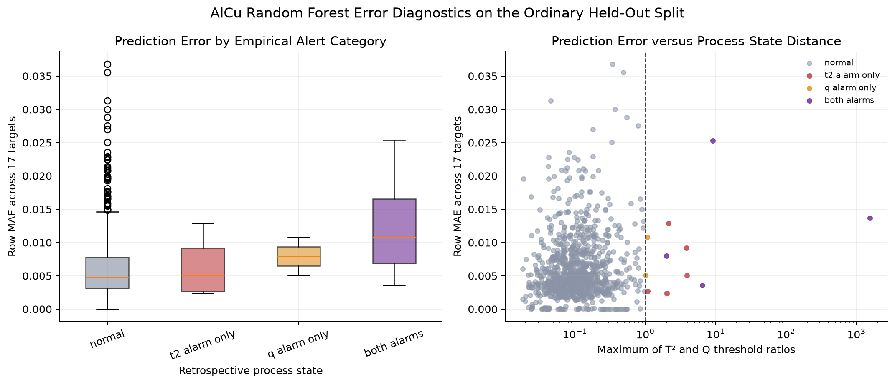
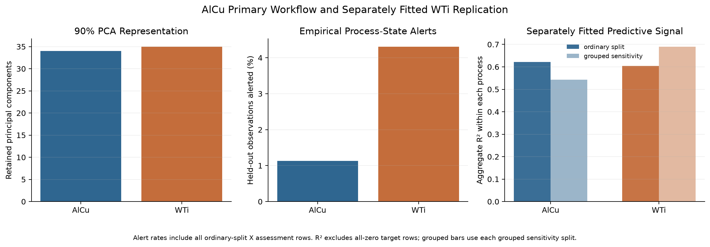

# Multivariate PVD Process Monitoring and Virtual Metrology

**Status:** Pre-audit v0.9. 

This project turns approximately 100 anonymized PVD process measurements into a
compact retrospective monitoring workflow. AlCu is the primary analysis. WTi is
fitted separately to check whether the same workflow remains useful on a second
deposition process.

The engineering focus is multivariate process-state monitoring: PCA reduces
correlated measurements, Hotelling T² and Q/SPE identify statistical
excursions, contribution plots prioritize anonymous channels for review, and a
small virtual-metrology section predicts all 17 released target measurements.

## Dataset

The project uses the public Infineon dataset
[Advanced Process Control and Statistical Process Control Data for Thickness Prediction of AlCu and WTi Metal Layer in Semiconductor Manufacturing](https://doi.org/10.5281/zenodo.16881338)
(CC BY 4.0).

| Process | Process inputs | Released targets | Observations |
|---|---:|---:|---:|
| AlCu | 97 | 17 | 4,848 |
| WTi | 108 | 17 | 1,740 |

The published files are anonymized, bounded on their released scale, and
already aggregated from sensor traces. Units, inverse scaling,
measurement-point geometry, timestamps,
equipment identifiers, recipe details, engineering specifications, and fault
labels are not supplied. Results are therefore reported only on the released
scale. They are not physical thickness or physical uniformity estimates.

The raw CSV files are intentionally ignored by Git. Download the four files
from the official DOI and place them unchanged in `data/raw/`. Expected MD5
checksums are listed in [`data/raw/README.md`](data/raw/README.md).

## Engineering Questions

1. Can correlated process measurements be reduced to an interpretable process-state view?
2. Which anonymous measurement channels contribute most to selected statistical excursions?
3. Are AlCu excursions associated with different released-scale output summaries?
4. Can the process inputs predict the 17 released targets, and does performance change for excursions or a grouped-profile split?

## Method

- Verify file checksums, shapes, missing values, duplicate structures, feature
  usability, and positional X/Y alignment.
- Retain the all-zero target records for process-state inspection, exclude them
  from primary target modeling, and report with/without sensitivity checks.
- Use an ordinary fixed 80/20 split as the primary validation. Use a second
  split grouped by exactly identical 17-target profiles only as a sensitivity
  check; equal target profiles are not treated as proven duplicate observations.
- Remove only features that are constant, exact duplicates, or at least 98%
  one value in the training data. This removes `Sensor_26` and `Sensor_63` for
  AlCu and no WTi features.
- Standardize process inputs on training rows, retain the smallest PCA
  representation reaching 90% explained variance, and calculate T² and Q/SPE
  explicitly.
- Set empirical alert thresholds at the training-set 99th percentiles. These
  descriptive thresholds use the same training rows as PCA; they are not
  independently calibrated false-alarm or chronological SPC limits.
- Predict all 17 targets directly with multi-output Linear Regression and
  Ridge. Add one fixed Random Forest only after it passes a 10% RMSE-improvement
  gate in training-only folds for both AlCu split designs across three random
  seeds.
- Refit the full workflow independently for WTi; no AlCu-fitted model is
  transferred to WTi.

## Results

| Result | AlCu | WTi |
|---|---:|---:|
| PCs retained for at least 90% variance | 34 | 35 |
| Retained explained variance | 90.55% | 90.16% |
| Ordinary held-out empirical-alert rate | 1.13% | 4.31% |
| Random Forest 17-target MAE | 0.00615 | 0.00519 |
| Random Forest 17-target RMSE | 0.00870 | 0.00829 |
| Random Forest aggregate R² | 0.622 | 0.604 |
| Grouped-profile Random Forest RMSE | 0.00926 | 0.00767 |

The virtual-metrology results are conditional on excluding each process's one
all-zero target row, whose meaning is unknown. AlCu and WTi RMSE values remain
on process-specific released scales and should not be used as a physical
cross-process ranking; R² is used in the comparison figure.

AlCu's grouped-profile RMSE was 6.4% higher than its ordinary-split RMSE and
aggregate R² fell from 0.622 to 0.543. Repeated target profiles therefore add
some optimism to the ordinary result, but the grouped result still retains
substantial released-scale predictive signal. WTi's grouped result did not
degrade.

On the AlCu held-out set, any-alert observations differed from normal
observations by -0.00610 in released-scale mean index and +0.00270 in
reference-profile shape deviation. Both clustered 95% bootstrap intervals
included zero, so the data do not establish a clear output-quality difference.

Random Forest row MAE was higher for AlCu both-alarm observations
(0.01263, n=4) than normal observations (0.00612, n=959). WTi Q-only and
both-alarm groups also had higher mean errors than normal, but every alarm
subgroup is small. These are descriptive warning signs, not validated
production reliability limits.

## Key Figures

### AlCu process-state monitoring


### Excursion contribution review


### Direct 17-target virtual metrology


### Error versus retrospective process state



### Separately fitted AlCu and WTi workflows



## Engineering Interpretation

T² highlights unusual combinations inside the retained PCA space. Q/SPE
highlights observations whose correlation structure is poorly reconstructed by
that space. Their four-category map gives an engineer a short investigation
queue. Contribution terms then identify measurement channels to inspect first;
they do not prove physical causation.

The nonlinear model improved consistently over the strongly regularized Ridge
baseline, suggesting useful nonlinear relationships in the released data.
However, anonymous features, absent specifications, and no chronological
sequence prevent equipment-root-cause, capability, formal control-limit, or
production-readiness claims.

## Repository Structure

```text
data/raw/       unchanged source files (CSVs ignored by Git)
data/processed/ generated row-level scores, splits, and predictions
src/            six numbered analysis scripts
figures/        generated engineering figures
results/        generated summary tables
report/         technical report and career/interview notes
```

## Running the Project

From the project directory:

```bash
python3 -m venv .venv
source .venv/bin/activate
python -m pip install -r requirements.txt
python src/01_data_audit.py
python src/02_preprocess_and_quality.py
python src/03_pca_monitoring.py
python src/04_excursion_analysis.py
python src/05_virtual_metrology.py
python src/06_wti_validation.py
```

Run the scripts in order because each stage uses verified outputs from the
previous stage. The project deliberately contains no notebook, dashboard,
package framework, or automated GitHub push.

## Limitations

- X/Y pairing is positional because the release contains no join key.
- Exact target profiles repeat, but different X rows with equal Y are not
  assumed to be duplicate wafers.
- One all-zero target row exists for each process; its meaning is unknown.
- Released values have no documented inverse scale or physical units.
- Measurement-point coordinates, specifications, known-good labels, fault
  labels, and chronology are unavailable.
- Empirical alerts identify statistical excursions only.
- Alarm-category comparisons have small excursion samples.
- WTi validates the workflow on a second released dataset, not on a production
  deployment or an external fab.

Because no engineering specification limits are available, Cp and Cpk are not
calculated. Because sequence is not established, the project does not claim
chronological SPC control limits or use I-MR, EWMA, or CUSUM charts.

See [`report/technical_report.md`](report/technical_report.md) for the concise
engineering report 
